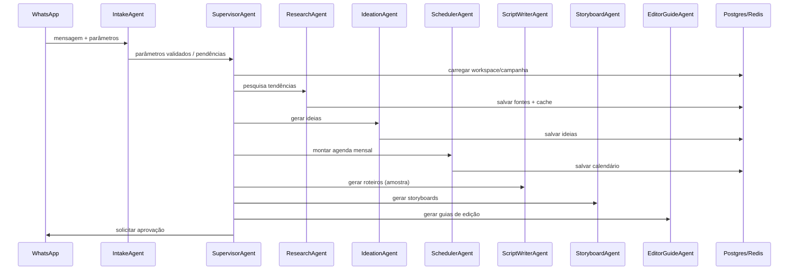

# Arquitetura (MVP)

## Fluxo principal (Mermaid)

## Componentes
- **API (FastAPI)**: webhooks, comandos e gatilhos de geração.
- **Worker**: scheduler diário para revisão.
- **Core**: agentes, estado do workflow, memória e orquestração.
- **Integrations**: provedores pluggáveis de LLM, busca web e WhatsApp.
- **Infra**: Docker Compose + Alembic migrations.
